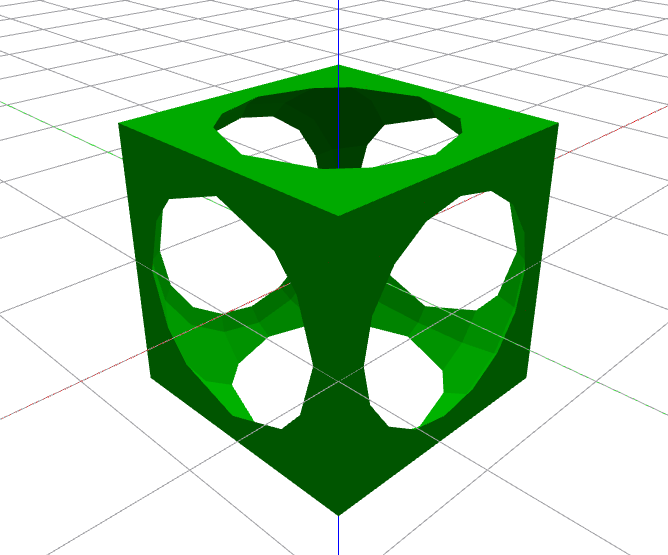

# csg.rs

Constructive Solid Geometry (CSG) is a modeling technique that uses Boolean operations like union and intersection to combine 3D solids. This library implements CSG operations on meshes simply using BSP trees.  It is meant to add CSG to the larger [Dimforge](https://www.dimforge.com/) ecosystem, be largely compatible with [OpenSCAD](https://openscad.org/), work in a wide variety of environments, and be reasonably performant.

Construct a 2D shape:

    let square = csgrs::square(None);
    let square2 = csgrs::square(Some(([2.0, 3.0], true)));
    let circle = csgrs::circle(None);
    let circle2 = csgrs::circle(Some((2.0, 64)));
    let points = vec![[0.0, 0.0], [2.0, 0.0], [1.0, 1.5]];
    let polygon2d = csgrs::polygon_2d(&points);

Construct a 3D shape:

    let cube = csgrs::cube(None);
    let cube2 = csgrs::cube(Some([0.0, 0.0, 0.0], [1.0, 1.0, 1.0])); // center, radius
    let sphere = csgrs::sphere(None);
    let sphere2 = csgrs::sphere(Some([0.0, 0.0, 0.0], 1.0, 16, 8)); // center, radius, slices, stacks
    let cylinder = csgrs::cylinder(None);
    let cylinder2 = csgrs::cylinder(Some([0.0, -1.0, 0.0], [0.0, 1.0, 0.0], 1.0, 16)); // start, end, radius, slices

Combine shapes:

    let union_result = cube.union(&sphere);
    let subtraction_result = cube.subtract(&sphere);
    let intersection_result = cylinder.intersect(&sphere);

Extract polygons:

    let polygons = union_result.to_polygons();
    println!("Polygon count = {}", polygons.len());
    
Translate:

    let translation_result = cube.translate(Vector3::new(3.0, 2.0, 1.0));

Rotate:

    let rotation_result = cube.rotate(15.0, 45.0, 0.0);

Scale:

    let scale_result = cube.scale(2.0, 1.0, 3.0);

Mirror:

    let mirror_result = cube.mirror(Axis::Y);
    
Convex hull:

    let hull = cube.convex_hull();

Minkowski sum:

    let rounded_cube = cube.minkowski_sum(&sphere);
    
Extrude a 2D shape:

    let square = csgrs::square(Some(([2.0, 2.0], true)));
    let prism = square.extrude(5.0);
    
Rotate extrude:

    let polygon = csgrs::polygon_2d(&[
        [1.0, 0.0],
        [1.0, 2.0],
        [0.5, 2.5],
    ]);
    let revolve_shape = polygon.rotate_extrude(360.0, 16); // degrees, steps
    
Bounding Box:

    let aabb = cube.bounding_box();
    println!("Axis-aligned bounding box mins: {:?}", aabb.mins);
    println!("Axis-aligned bounding box maxs: {:?}", aabb.maxs);

Export an STL:

    let stl_data = union_result.to_stl("cube_minus_sphere");
    let filename = "output.stl";
    let mut file = File::create(filename).expect("Failed to create file");
    file.write_all(stl_data.as_bytes()).expect("Failed to write STL");

# Implementation Details

All CSG operations are implemented in terms of two functions, `clip_to()` and `invert()`, which remove parts of a BSP tree inside another BSP tree and swap solid and empty space, respectively. To find the union of `a` and `b`, we want to remove everything in `a` inside `b` and everything in `b` inside `a`, then combine polygons from `a` and `b` into one solid:

    a.clip_to(&b);
    b.clip_to(&a);
    a.build(&b.all_polygons());

The only tricky part is handling overlapping coplanar polygons in both trees. The code above keeps both copies, but we need to keep them in one tree and remove them in the other tree. To remove them from `b` we can clip the inverse of `b` against `a`. The code for union now looks like this:

    a.clip_to(&b);
    b.clip_to(&a);
    b.invert();
    b.clip_to(&a);
    b.invert();
    a.build(&b.all_polygons());

Subtraction and intersection naturally follow from set operations. If union is `A | B`, subtraction is `A - B = ~(~A | B)` and intersection is `A & B = ~(~A | ~B)` where `~` is the complement operator.

# Todo
- Extrusions from X, Y, or Z
- Measurement function
- Grow / Shrink / 2D offset
- Projection
- dxf export
- Vector font / text function / textmetrics
- multmatrix (just expose the nalgebra functionality)
- color
- fragments (circle, sphere, regularize with rotate_extrude)
- polyhedron w/ examples
- polygon holes
- fill

# License

Copyright (c) 2025 Timothy Schmidt, initially based on a translation of CSG.js Copyright (c) 2011 Evan Wallace, under the [MIT license](http://www.opensource.org/licenses/mit-license.php).
